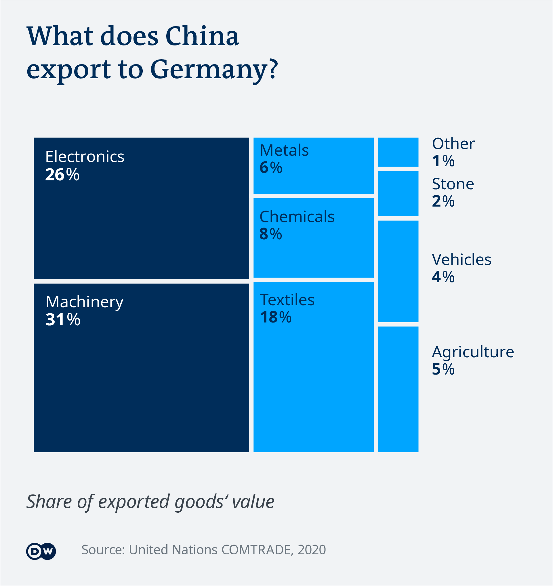

# Economic interdependence

_Idea:_  [Gianna Grün](https://gcgruen.github.io)\
_Research, data analysis and data visualization:_  [Michel Penke](https://michelpenke.de)\
_Writing:_  [Michel Penke](https://michelpenke.de)

**Read the full articles on DW.com:**
- [XXX](https://www.dw.com/en/xxx)
- [XXX](https://www.dw.com/en/xxx)
- [XXX](https://www.dw.com/en/xxx)
- [XXX](https://www.dw.com/en/xxx)
- [XXX](https://www.dw.com/en/xxx)
- [XXX](https://www.dw.com/en/xxx)
- [XXX](https://www.dw.com/en/xxx)
- [XXX](https://www.dw.com/en/xxx)

To mark the federal election in Germany in September 2021, we looked at the economic interdependence between Germany and eight different countries (China, Brazil, Poland, Russia, Indonesia, India, Iran and Pakistan). Special attention was given to direct investment, trade balance, traded goods, language, student exchange and tourism. 

The following text will explain the process behind this story: Which data sources were used, how the analysis was conducted and how the data was visualized.

# Source data

| **Data** | **Source** | **Link** |
| --- | --- | --- |
| Dataset about international Trade | UN Comtrade| [Comtrade](https://comtrade.un.org)|
| Dataset Reiseanalyse | Forschungsgemeinschaft Urlaub und Reisen (e.V.), Kiel: Reiseanalyse 2021| [Reiseanalyse](https://reiseanalyse.de/reiseanalyse/)|
| Dataset Tourismus in Zahlen (2019) | Destatis| [Tourismus in Zahlen - 2019](https://www.destatis.de/DE/Themen/Branchen-Unternehmen/Gastgewerbe-Tourismus/Publikationen/Downloads-Tourismus/tourismus-in-zahlen-1021500197005.html)|
| Dataset Studierende an Hochschulen | Destatis| [Studierende an Hochschulen](https://www.destatis.de/DE/Themen/Gesellschaft-Umwelt/Bildung-Forschung-Kultur/Hochschulen/Publikationen/Downloads-Hochschulen/studierende-hochschulen-ss-2110410207314.html)|
| Dataset Deutsch als Fremdsprache weltweit| Goethe Institut | [Deutsch als Fremdsprache weltweit](https://www.goethe.de/resources/files/pdf204/bro_deutsch-als-fremdsprache-weltweit.-datenerhebung-2020.pdf)|
| Dataset Direktinvestitionen | Bundesbank | [Zahlungsbilanzstatistik](https://www.bundesbank.de/resource/blob/805268/2144a6744950df47965bced9f2e58414/mL/0-zahlungsbilanzstatistik-data.pdf)|
| Dataset Trade Goods | Havard: The Atlas of Economic Complexity | [Atlas of Economic Complexity](https://atlas.cid.harvard.edu/explore/stack)|

# Analysis
### Trade balance & traded goods

The first chart basically only compares the export and import values of the respective country with Germany over a period from 1995 to 2018. Services were left out of the equation.

Furthermore, the product groups of the traded goods for the year 2020 were presented as a share of total imports and exports. 

In the area of tourism, the shares of each country or group of countries were calculated and visualised in relation to their respective continent or 'major region' such as the Middle East. Consequently, the percentages for a country may vary if, as in the case of Russia, it was sometimes presented as part of Asia, sometimes as part of Europe. 

In the case of students of German, there were a lot of different data, some of which differed greatly from each other. In this case, we decided to collect data from the Goethe Institute as uniformly as possible, even though some of their data points were significantly lower than those of local data sets. 

For Poland, due to journalistic considerations, instead of a visualisation of tourism, a graph on migration between Poland and Germany was created. 

